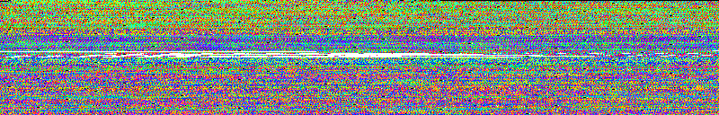
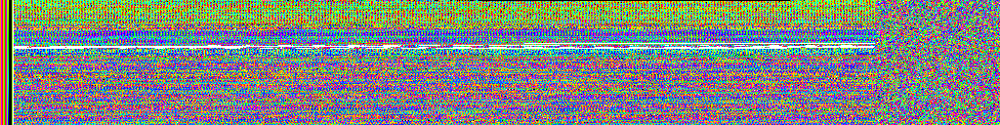

# binops, *Bin*ary Data Transformation *Op*eration*s*

This is a collection of UNIX-like utilities for doing collection-like
transformation operations on binary data files/pipes.

## Utilities

| Name                        | Description |
| --------------------------- | ----------- |
| [`bvisualize`](#bvisualize) | An interactive hexdump GUI where the color of a pixel indicates the byte value.
| `bstride`                   | Output date relative to fixed/variable length records.
| `hex2bin`                   | Given hex data like `10 0-f f*a`, write it as binary data.
| `uniq_cols.gawk`            | Linewise field counter (e.g. `1 2 2 2 1` -> `1 2*3 1`).
| `xd`                        | `od` wrapper for printing hex-based bytes.

### Future additions

| Name          | Description |
| ------------- | ----------- |
| ~~`bgrep`~~   | Copy records matching pattern.
| ~~`bscan`~~   | Scan for pattern and copy match/before/after/between.
| ~~`bmap `~~   | or extend `bstride` with expression on data within records.
| ~~`baggre`~~  | or extend `bmap` with expression across records.
| ~~`buniq`~~   | `uniq` tool with mask `-c` and `-d` for records.
| ~~`bsearch`~~ | Binary search sorted fixed size records.
| ~~`bsort`~~   | Sort records by e.g. `-fCUT-LIKE-FIELDS`.

Note that names are only preliminary, order is kind of prioritized, and that
strikethrough is just to emphasize that these do not exist yet.

## Install

Add the `bin` directory to your path.

## Bugs

These utilities are initially being developed as prototypes in scripting
languages to see what sort utilities and functionality that is most useful.
However, this is certainly not the most efficient way of implementing them, so
the most performance critical ones may benefit from being reimplemented in a
compiled language (e.g. C/C++ or Julia) in the future.

## Bvisualize

This tool is useful to search for repeating and/or interesting patterns in a
binary file. For instance, satellite downlinks sends data in fixed size frames
starting with a header and ending in random-looking error correction codes
[[CCSDS AOS Space Data Link
Protocol](https://public.ccsds.org/Pubs/732x0b4.pdf), 4.1]. The size of these
frames varies from satellite to satellite and it is considered a priori
information that is not encoded anywhere in data stream.

If you know more from the data, like e.g. that those frames also start with a
fixed 0x1acffc1d bit pattern, you can easily parse the data. However, even
without any knowledge those frames easily stand out if the data is visualized
with a similiar alignment. For instance this bvisualize screenshot:

Just kidding, that looks mostly random because the width does not match the
frames. But the width of the bvisualize rendering can be changed with the `q`
and `e` keys. And the pattern is clear when this width match the frames:

It is not as clear, but a pattern is also emerging also when the alignment gets
close to the frame width. E.g. 4 pixels too small and 4 pixels to wide:

